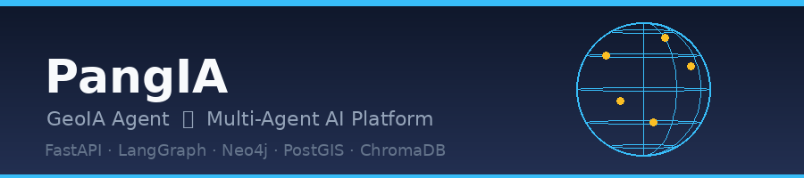

# PangIA – GeoIA Agent 🌍

A minimal AI agent chat application with a **multi-agent architecture**:

| Layer | Technology |
|---|---|
| **Frontend** | Vue 3 + ai-elements-vue, Vite, TypeScript |
| **Backend** | FastAPI, Server-Sent Events (SSE) |
| **Orchestration** | LangChain + LangGraph (master agent + 4 sub-agents) |
| **Knowledge Graph** | Neo4j (Cypher) |
| **RDF / Linked Data** | Ontotext GraphDB (SPARQL) |
| **Vector Search** | ChromaDB (embeddings) |
| **Spatial SQL** | PostgreSQL + PostGIS |
| **Sessions** | Redis |
| **Observability** | Arize Phoenix (traces, spans, LLM call inspection) |
| **Infrastructure** | Docker Compose |

---

## Table of Contents

- [Multi-agent architecture](#multi-agent-architecture)
  - [Agent enable / disable flags](#agent-enable--disable-flags)
  - [Agent fault tolerance](#agent-fault-tolerance)
  - [Agent ReAct loop iterations](#agent-react-loop-iterations)
  - [Per-agent LLM configuration](#per-agent-llm-configuration)
  - [SSE event types](#sse-event-types)
  - [Data Visualisation Agent](#data-visualisation-agent)
  - [Map Agent](#map-agent)
- [Quick Start](#quick-start)
  - [1. Configure environment](#1-configure-environment)
  - [2. Start all services](#2-start-all-services)
- [Observability (Arize Phoenix)](#observability-arize-phoenix)
  - [Configuration](#configuration)
- [Project structure](#project-structure)
- [Development (without Docker)](#development-without-docker)
  - [Backend](#backend)
  - [Frontend](#frontend)
- [Seed themes](#seed-themes)
  - [Switching the theme](#switching-the-theme)
  - [Adding a new theme](#adding-a-new-theme)
- [Adding a new sub-agent](#adding-a-new-sub-agent)

---

## Multi-agent architecture

```
User query  +  selected_agents? (optional)
    │
    ▼
┌──────────────────────────────────────────────────────────────────┐
│                         Master Agent                             │
│                                                                  │
│  config flags (enabled/disabled)                                 │
│       ∩  user selection (selected_agents)                        │
│       = eligible pool                                            │
│               │                                                  │
│          ┌────▼────┐   Send fan-out   ┌──────────────────────┐   │
│          │ router  │─────────────────►│ neo4j_agent          │─┐ │
│          │ (LLM +  │                  │ (Cypher / Neo4j)     │ │ │
│          │ struct) │─────────────────►│ rdf_agent            │─┤ │
│          └─────────┘                  │ (SPARQL / GraphDB)   │ │ │
│                                       │ vector_agent         │─┤ │
│                                       │ (Chroma embeddings)  │ │ │
│                                       │ postgis_agent        │─┤ │
│                                       │ (PostGIS SQL)        │ │ │
│                                       │ data_gouv_agent      │─┘ │
│                                       │ (data.gouv.fr MCP)   │   │
│                                       └──────────────────────┘   │
│                          (barrier: wait for all parallel agents)  │
│                                               │                  │
│                                  post_process_router             │
│                                  (synchronisation barrier)       │
│                             ┌─────────┴──────────┐              │
│                             │  Send fan-out       │              │
│                    ┌────────▼────────┐  ┌─────────▼──────────┐  │
│                    │   map_agent     │  │   dataviz_agent    │  │
│                    │ (GeoJSON / map) │  │ (charts/KPI/tbl)   │  │
│                    └────────┬────────┘  └─────────┬──────────┘  │
│                             └─────────┬───────────┘              │
│                                       │                          │
│                                       │                          │
│                                       │ (barrier: wait for both) │
│                                       │                          │
│                                       ┌───────▼──────────┐       │
│                                       │   merge node     │       │
│                                       │  (synthesise)    │       │
│                                       └───────┬──────────┘       │
└───────────────────────────────────────────────┼──────────────────┘
                                                ▼
                                         Streamed answer (SSE)
```

The **router** selects the minimum set of relevant sub-agents from an *eligible
pool* constrained by two layers:

1. **Server-side config** — each sub-agent can be individually enabled or
   disabled via environment variables (all default to `true`).  Disabled agents
   are excluded from the graph entirely.
2. **User selection** — a caller can pass `"selected_agents": ["neo4j", "vector"]`
   in the `POST /api/chat` request body to restrict routing to a specific subset.
   An empty list (or omitting the field) means *"no preference"* — the router
   considers all active agents.

Within the eligible pool, the router LLM (structured output) picks the agents
that best suit the query.  Each selected agent runs its own ReAct loop (LLM +
tools) and writes its result into a shared `sub_results` dict.

After all data-source agents complete, a **`post_process_router`** barrier fans
out to `map_agent` and `dataviz_agent` **in parallel** (both read `sub_results`
independently and write to separate state keys: `geojson` and `dataviz`).  The
**merge** node then waits for both and synthesises all results into a final
streamed answer.

### Agent enable / disable flags

| Variable | Default | Description |
|---|---|---|
| `NEO4J_AGENT_ENABLED` | `true` | Knowledge Graph agent (Cypher / Neo4j) |
| `RDF_AGENT_ENABLED` | `true` | RDF/Linked Data agent (SPARQL / GraphDB) |
| `VECTOR_AGENT_ENABLED` | `true` | Semantic search agent (ChromaDB) |
| `POSTGIS_AGENT_ENABLED` | `true` | Spatial SQL agent (PostGIS) |
| `DATA_GOUV_AGENT_ENABLED` | `true` | French open-data agent (data.gouv.fr via MCP) |
| `MAP_AGENT_ENABLED` | `true` | Geographic visualisation agent (GeoJSON / Leaflet map) |
| `DATAVIZ_AGENT_ENABLED` | `true` | Data visualisation agent (charts, KPIs, tables) |

Set any flag to `false` in `.env` to exclude that agent from all routing decisions.
The orchestrator always keeps at least one agent active as a fallback (defaults to `neo4j`).

### Agent fault tolerance

Every agent's `run()` function wraps its logic in a top-level `try/except`.
If an agent raises any exception (network error, 502 from an external MCP
server, database unreachable, timeout, …), it catches it and returns a
graceful fallback result — e.g. `[data.gouv agent unavailable: 502 Bad Gateway]`
— stored in `sub_results` under its key.

This means:
- **The chain never crashes** because of a single failing agent.
- All other agents (including `merge`) continue normally.
- The final answer is synthesised from whatever results are available.
- The error message is visible in the agent activity panel in the UI.

### Agent ReAct loop iterations

Each agent runs a ReAct loop (LLM call → tool call → observation → …).
The number of iterations is configurable at two levels:

| Variable | Default | Description |
|---|---|---|
| `AGENT_MAX_ITERATIONS` | `10` | Global fallback used by all agents |
| `NEO4J_AGENT_MAX_ITERATIONS` | `0` | Neo4j agent override (0 = use global) |
| `RDF_AGENT_MAX_ITERATIONS` | `0` | RDF/SPARQL agent override |
| `VECTOR_AGENT_MAX_ITERATIONS` | `0` | Vector agent override |
| `POSTGIS_AGENT_MAX_ITERATIONS` | `0` | PostGIS agent override |
| `MAP_AGENT_MAX_ITERATIONS` | `0` | Map agent override |
| `DATA_GOUV_AGENT_MAX_ITERATIONS` | `0` | data.gouv.fr agent override |
| `DATAVIZ_AGENT_MAX_ITERATIONS` | `0` | DataViz agent override |

Lower the value to reduce latency and cost; raise it for agents that need more
tool-call steps (e.g. data.gouv or PostGIS on complex spatial queries).

### Per-agent LLM configuration

Every agent (including the router and the merge node) can use a **different LLM model and provider** independently of the global `OPENAI_MODEL` setting.  Two environment variables control each agent:

| Variable pattern | Example value | Description |
|---|---|---|
| `<AGENT>_MODEL_PROVIDER` | `openai`, `anthropic`, `ollama` | Provider for this agent. Leave empty to use the global provider. |
| `<AGENT>_MODEL_NAME` | `gpt-4o`, `claude-3-5-sonnet-latest`, `llama3` | Model name for this agent. Leave empty to fall back to `OPENAI_MODEL`. |

Available `<AGENT>` prefixes: `ROUTER`, `NEO4J_AGENT`, `RDF_AGENT`, `VECTOR_AGENT`, `POSTGIS_AGENT`, `MAP_AGENT`, `DATA_GOUV_AGENT`, `DATAVIZ_AGENT`, `MERGE`.

Example `.env` — use a powerful model for the router and merge, a cheaper one for sub-agents:

```env
# Global fallback
OPENAI_API_KEY=sk-...
OPENAI_MODEL=gpt-4o-mini

# Router and synthesis need stronger reasoning
ROUTER_MODEL_PROVIDER=openai
ROUTER_MODEL_NAME=gpt-4o
MERGE_MODEL_PROVIDER=openai
MERGE_MODEL_NAME=gpt-4o

# Use a local Ollama model for the vector agent
VECTOR_AGENT_MODEL_PROVIDER=ollama
VECTOR_AGENT_MODEL_NAME=llama3
```

Leave both variables empty (the default) to use the global `OPENAI_MODEL` for every agent.

### SSE event types

| Event type | Meaning |
|---|---|
| `session` | Session ID assigned for this conversation |
| `routing` | Which sub-agents were selected (list of names) |
| `agent_token` | Intermediate reasoning token from a sub-agent |
| `token` | Final synthesis token (streamed to user) |
| `tool_start` | A sub-agent started a tool call |
| `tool_end` | A sub-agent tool call completed |
| `geojson` | GeoJSON FeatureCollection from the Map agent (rendered as interactive Leaflet map) |
| `dataviz` | Visualisation payload from the DataViz agent (charts, KPI cards, tables) |
| `error` | An error occurred |
| `done` | Stream complete |

### Data Visualisation Agent

The **DataViz Agent** (`dataviz_agent`) runs **sequentially after the Map agent**, reading the accumulated
`sub_results` from all parallel sub-agents to detect and format numerical / statistical data.

### Map Agent

The **Map Agent** (`map_agent`) runs after the parallel data-source agents and extracts geographic
coordinates from their `sub_results` to build a GeoJSON FeatureCollection rendered as an interactive
Leaflet map in the UI.

> **Note on iterations:** the Map Agent often requires **multiple ReAct loop iterations** to complete
> its work — it typically needs one turn to call its coordinate-extraction tool, then one or more
> additional turns to format the final GeoJSON output.  If the map is not appearing, the most common
> cause is `MAP_AGENT_MAX_ITERATIONS` (or the global `AGENT_MAX_ITERATIONS`) being set too low.
> The recommended minimum is **5**; the default is **10**.


**Responsibilities:**
- Detect visualisable data (counts, averages, distributions, time-series, proportions)
- Choose the most appropriate visualisation type
- Produce chart structures compatible with **D3.js**
- Compute **KPI cards** (value, unit, variation, trend, threshold)
- Generate **formatted tables** (column headers + row data)

**Output types:**

| Type | Description | Frontend component |
|---|---|---|
| `charts` | Bar, line, pie, scatter, or histogram chart data | `ChartViewer.vue` (D3.js) |
| `kpis` | Key performance indicator cards with trend indicators | `KpiCards.vue` |
| `tables` | Tabular data with column headers and rows | `TableViewer.vue` (PrimeVue DataTable) |

When the DataViz agent produces visualisations, they are rendered in the chat interface
automatically:
- 📊 **Charts** are rendered using D3.js for bar, line, pie, scatter, and histogram types.
- 🔢 **KPI cards** display key metrics with trend direction (↑ up / ↓ down / → stable).
- 📋 **Tables** use PrimeVue DataTable for scrollable, formatted tabular display.

The DataViz agent can be **disabled without affecting any other agent** by setting
`DATAVIZ_AGENT_ENABLED=false` in your `.env` file.

---

## Quick Start

### 1. Configure environment

```bash
cp .env.example .env
# Edit .env and set at minimum: OPENAI_API_KEY
```

### 2. Start all services

```bash
docker compose up --build
```

| Service | URL | Purpose |
|---|---|---|
| Frontend | http://localhost:3000 | Chat UI |
| Backend API | http://localhost:8000 | FastAPI + LangGraph |
| Neo4j Browser | http://localhost:7474 | Knowledge graph |
| GraphDB Workbench | http://localhost:7200 | RDF triplestore |
| ChromaDB | http://localhost:8001 | Vector store |
| PostGIS | localhost:5432 | Spatial database |
| Phoenix UI | http://localhost:6006 | Agent observability (traces & spans) |

---

## Observability (Arize Phoenix)

All LangChain/LangGraph spans — router decisions, sub-agent calls, LLM round-trips, and tool invocations — are captured automatically via [OpenInference](https://github.com/Arize-ai/openinference) auto-instrumentation and sent to the bundled [Arize Phoenix](https://github.com/Arize-ai/phoenix) collector.

Open **http://localhost:6006** after `docker compose up` to explore:

- **Traces** – end-to-end request traces from user query to streamed answer
- **Spans** – individual steps: routing decision, each sub-agent ReAct loop, LLM calls, tool starts/ends
- **LLM call inspector** – prompt tokens, completion tokens, latency, model name

Phoenix is registered during FastAPI's lifespan startup (`backend/app/main.py`) so it never blocks the application from starting if the collector is temporarily unavailable.

### Configuration

| Variable | Default | Description |
|---|---|---|
| `PHOENIX_COLLECTOR_ENDPOINT` | `http://phoenix:6006/v1/traces` | OTLP HTTP endpoint (set automatically in Docker) |
| `PHOENIX_PROJECT_NAME` | `pangia-geoia` | Project name shown in the Phoenix UI |

Override `PHOENIX_PROJECT_NAME` in `.env` to organise traces across multiple environments.

---

## Project structure

```
pangia-poc/
├── docker-compose.yml
├── .env.example
├── docs/
│   └── banner.png
├── backend/
│   ├── Dockerfile
│   ├── requirements.txt
│   └── app/
│       ├── main.py              # FastAPI app factory + lifespan
│       ├── config.py            # Pydantic settings
│       ├── api/
│       │   └── routes.py        # POST /api/chat (SSE), GET /api/suggestions
│       ├── agent/
│       │   ├── state.py         # AgentState (messages, agents_to_call, sub_results)
│       │   ├── master.py        # Master orchestrator (router → fan-out → merge)
│       │   ├── neo4j_agent.py   # Knowledge Graph sub-agent (Cypher)
│       │   ├── rdf_agent.py     # RDF sub-agent (SPARQL / GraphDB)
│       │   ├── vector_agent.py  # Vector sub-agent (ChromaDB)
│       │   ├── postgis_agent.py # Spatial SQL sub-agent (PostGIS)
│       │   ├── map_agent.py     # Map post-processor (GeoJSON)
│       │   ├── dataviz_agent.py # DataViz post-processor (charts/KPIs/tables)
│       │   └── specialized/
│       │       ├── data_gouv_agent.py      # French open-data sub-agent (data.gouv.fr MCP)
│       │       └── geo/
│       │           ├── geo_master_agent.py         # Geospatial orchestrator (routes to geo sub-agents)
│       │           ├── geo_address_agent.py         # L1: Geocoder – address ↔ coordinates
│       │           ├── geo_spatial_parser_agent.py  # L1: SpatialParser – NL spatial understanding
│       │           ├── geo_distance_agent.py        # L1: DistanceCalc – great-circle distances
│       │           ├── geo_buffer_agent.py          # L1: BufferAnalyser – circular buffer zones
│       │           ├── geo_isochrone_agent.py       # L1: Isochrone – accessibility zone estimation
│       │           ├── geo_proximity_agent.py       # L2: Proximity – nearest-entity search
│       │           ├── geo_intersection_agent.py    # L2: Intersection – spatial overlap analysis
│       │           ├── geo_area_agent.py            # L2: AreaCalculator – polygon surface areas
│       │           ├── geo_hotspot_agent.py         # L2: Hotspot – cluster detection & density
│       │           ├── geo_shortest_path_agent.py   # L2: ShortestPath – route optimisation
│       │           ├── geo_elevation_agent.py       # L3: Elevation – altitude retrieval (Open-Meteo)
│       │           ├── geo_geometry_ops_agent.py    # L3: GeometryOps – GeoJSON transformations
│       │           ├── geo_temporal_agent.py        # L3: TemporalAnalyst – spatio-temporal patterns
│       │           └── geo_viewshed_agent.py        # L3: Viewshed – geometric visibility analysis
│       └── db/
│           ├── neo4j_client.py
│           ├── graphdb_client.py
│           ├── chroma_client.py
│           ├── postgis_client.py
│           ├── redis_client.py
│           ├── seed.py          # Seed runner (reads active theme, populates all stores)
│           └── themes/
│               ├── __init__.py  # SeedTheme dataclass + get_active_theme()
│               └── dinosaurs.py # Built-in seed theme (Mesozoic palaeontology)
└── frontend/
    ├── Dockerfile
    ├── nginx.conf
    ├── package.json
    ├── vite.config.ts
    └── src/
        ├── main.ts              # PrimeVue setup + theme (Yellow/Aura preset)
        ├── types.ts             # Message, AgentActivity types + helpers
        ├── assets/
        │   └── main.css
        └── components/
            ├── ChatView.vue             # Root chat controller (SSE, state)
            └── ChatView/
                ├── ChatHeader.vue       # Session ID display
                ├── ChatMessages.vue     # Message list + suggestions
                ├── ChatMessage.vue      # Router: user vs agent
                ├── ChatUserMessage.vue  # User bubble
                ├── ChatAgentMessage.vue # Agent bubble (activity panels + answer)
                └── ChatPrompt.vue       # Textarea + send button
```

## Development (without Docker)

### Backend

```bash
cd backend
python -m venv .venv && source .venv/bin/activate
pip install -r requirements.txt
cp ../.env.example .env  # set OPENAI_API_KEY and data-store connection strings
uvicorn app.main:app --reload
```

### Frontend

```bash
cd frontend
npm install --legacy-peer-deps
npm run dev
# → http://localhost:5173 (proxies /api to localhost:8000)
```

---

## Seed themes

The application is populated with sample data at startup via a **seed theme**.
The active theme is selected by the `SEED_THEME` environment variable (default: `pandemic`).
Seeding is controlled by `SEED_DB` (default: `true`); set it to `false` in production.

Each theme provides data for all four datastores (Neo4j, PostGIS, GraphDB, ChromaDB)
as well as the schema prompts, agent guidelines, and UI suggestions used by the agents.

### Switching the theme

Set `SEED_THEME` in your `.env` before starting the stack:

```bash
SEED_THEME=my_theme docker compose up --build
```

### Adding a new theme

1. Create `backend/app/db/themes/<my_theme>.py` and expose a `theme` variable of
   type `SeedTheme` (see `backend/app/db/themes/__init__.py` for the full dataclass).
   Use `backend/app/db/themes/dinosaurs.py` as a reference implementation.

2. Fill in **all relevant fields** of `SeedTheme`:

   | Field | Purpose |
   |---|---|
   | `neo4j_statements` | Idempotent Cypher statements (MERGE) to seed the graph |
   | `postgis_statements` | DDL + DML SQL statements for tables and rows |
   | `graphdb_named_graph` + `graphdb_turtle` | Named graph URI and Turtle RDF content |
   | `chroma_documents` | List of `{"text": str, "metadata": dict}` docs to embed |
   | `neo4j_schema_prompt` | Graph schema description injected into the Neo4j agent |
   | `postgis_schema_prompt` | Table/column description injected into the PostGIS agent |
   | `rdf_schema_prompt` | Ontology description injected into the RDF agent |
   | `neo4j_guidelines` | Theme-specific query hints for the Neo4j agent |
   | `postgis_guidelines` | Theme-specific query hints for the PostGIS agent |
   | `rdf_guidelines` | Theme-specific query hints for the RDF agent |
   | `vector_guidelines` | Theme-specific hints for the Vector agent |
   | `suggestions` | Example prompts shown in the chat UI |

3. **Review the router's agent descriptions and routing rules** in
   `backend/app/agent/master.py`:
   - `_AGENT_DESCRIPTIONS` — the short capability blurb shown to the router LLM
     for each agent.  If your theme stores data in a way that differs from the
     generic description (e.g. PostGIS holds domain-specific tables with
     coordinates), refine the description so the router knows to select that agent.
   - `_EXTRA_ROUTING_RULES` — explicit rules that override or supplement the
     router's judgment for common question patterns in your domain (e.g. "questions
     about X location → include both neo4j and postgis").  Add domain-specific
     rules here rather than embedding them in the agent descriptions.

   Keep both sections as generic as possible; add only rules that are genuinely
   necessary for correct routing in your theme.

4. Set `SEED_THEME=<my_theme>` and start the stack.

---

## Adding a new sub-agent

Sub-agents live in `backend/app/agent/`.  To add one:

1. **Create `backend/app/agent/<name>_agent.py`** with an `async def run(state: AgentState) -> dict` function.
   Follow the existing agents as a template (ReAct loop: LLM + tools, write result to `sub_results`).

2. **Connect it to the master orchestrator** in `backend/app/agent/master.py`:
   - Declare it as a valid literal in `RoutingDecision.agents`.
   - Add an import and a `Send` mapping in `fan_out_node`.
   - Register it in `AGENT_LABELS`.
   - Update `ROUTER_SYSTEM` to include its description and routing rules.

3. **Write a clear `_BASE_SYSTEM_PROMPT`** for the agent. Keep generic query mechanics
   (tool selection, output format, error handling) in the base prompt in the agent file.
   Move anything **specific to the active dataset** into the theme's corresponding
   `<store>_guidelines` field so any future theme can override it without touching agent code.

4. **Define the database schema** in the seed theme's `<store>_schema_prompt` field
   (node labels, relationship types, table columns, ontology prefixes, etc.).
   The more precise the schema description, the better the LLM will generate correct queries.

5. **Expose a `GET /api/suggestions`** update is automatic — suggestions are already
   served from the active theme's `suggestions` list.

---

## Geo Agent – Geospatial Analysis

The **Geo Agent** (`backend/app/agent/specialized/geo/geo_master_agent.py`) is a specialised
orchestrator for advanced geospatial analysis tasks.  It is available as a parallel
sub-agent in the master orchestrator (enabled by default via `GEO_AGENT_ENABLED=true`).

When the master router selects `geo`, the Geo Agent uses its own internal LLM router
to dispatch to the most appropriate geo sub-agents and merges their outputs.

### Sub-agent hierarchy

| Level | Key | Agent file | Capability |
|-------|-----|-----------|------------|
| 1 – MVP | `geo_address` | `geo_address_agent.py` | Geocoder – address ↔ coordinates (Nominatim) |
| 1 – MVP | `geo_spatial_parser` | `geo_spatial_parser_agent.py` | SpatialParser – natural language spatial understanding |
| 1 – MVP | `geo_distance` | `geo_distance_agent.py` | DistanceCalc – great-circle distance calculations |
| 1 – MVP | `geo_buffer` | `geo_buffer_agent.py` | BufferAnalyser – circular and multi-ring buffer zones |
| 1 – MVP | `geo_isochrone` | `geo_isochrone_agent.py` | Isochrone – travel-time accessibility zones |
| 2 – Evolution | `geo_proximity` | `geo_proximity_agent.py` | Proximity – nearest-entity search and ranking |
| 2 – Evolution | `geo_intersection` | `geo_intersection_agent.py` | Intersection – bounding-box overlap and containment |
| 2 – Evolution | `geo_area` | `geo_area_agent.py` | AreaCalculator – polygon surface area computation |
| 2 – Evolution | `geo_hotspot` | `geo_hotspot_agent.py` | Hotspot – point-cluster detection and density |
| 2 – Evolution | `geo_shortest_path` | `geo_shortest_path_agent.py` | ShortestPath – waypoint route optimisation |
| 3 – Specialised | `geo_elevation` | `geo_elevation_agent.py` | Elevation – altitude retrieval (Open-Meteo API) |
| 3 – Specialised | `geo_geometry_ops` | `geo_geometry_ops_agent.py` | GeometryOps – GeoJSON transformations and validation |
| 3 – Specialised | `geo_temporal` | `geo_temporal_agent.py` | TemporalAnalyst – spatio-temporal pattern detection |
| 3 – Specialised | `geo_viewshed` | `geo_viewshed_agent.py` | Viewshed – geometric visibility analysis |

### Configuration

| Environment variable | Default | Description |
|---|---|---|
| `GEO_AGENT_ENABLED` | `true` | Enable/disable the entire Geo Agent |
| `GEO_AGENT_MODEL_PROVIDER` | `` | LLM provider for the internal geo router and merge step |
| `GEO_AGENT_MODEL_NAME` | `` | LLM model name (falls back to global `OPENAI_MODEL`) |
| `GEO_AGENT_MAX_ITERATIONS` | `0` | Max ReAct loop iterations (0 = global default) |
| `GEO_<SUBAGENT>_AGENT_MODEL_PROVIDER` | `` | Per-sub-agent model provider override |
| `GEO_<SUBAGENT>_AGENT_MODEL_NAME` | `` | Per-sub-agent model name override |
| `GEO_<SUBAGENT>_AGENT_MAX_ITERATIONS` | `0` | Per-sub-agent max iterations override |

Replace `<SUBAGENT>` with `ADDRESS`, `SPATIAL_PARSER`, `DISTANCE`, `BUFFER`,
`ISOCHRONE`, `PROXIMITY`, `INTERSECTION`, `AREA`, `HOTSPOT`, `SHORTEST_PATH`,
`ELEVATION`, `GEOMETRY_OPS`, `TEMPORAL`, or `VIEWSHED`.

### Notes

- Isochrone, buffer, and viewshed computations are **geometric approximations**
  based on straight-line (great-circle) distances and do not use road networks or DEMs.
- Elevation data is retrieved from the [Open-Meteo elevation API](https://open-meteo.com/)
  which is free and requires no API key.
- For precise polygon operations (intersection, area, routing), the PostGIS agent
  (`postgis_agent.py`) with PostGIS SQL remains the recommended approach.
