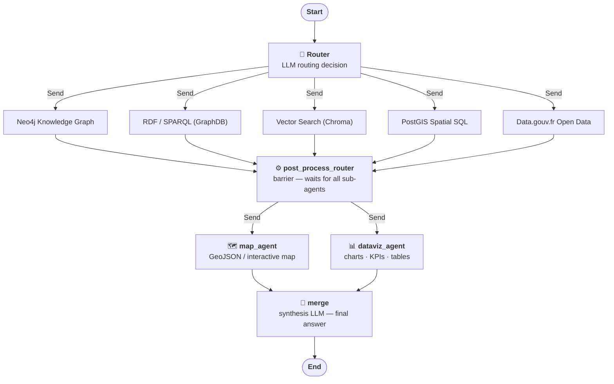

# PangIA – Agent Workflow Graph

> This file is **auto-generated** at build time by
> [`generate_graph.py`](./generate_graph.py).  
> Re-generate locally with:
> ```
> python backend/app/agent/generate_graph.py
> ```

The diagram below maps the full LangGraph workflow executed by the PangIA
multi-agent backend for every user query.



## Node descriptions

| Node | Role |
|---|---|
| **Router** | LLM with structured output — selects the minimal set of parallel sub-agents relevant to the query |
| **neo4j\_agent** | Knowledge-graph queries (Cypher / Neo4j) |
| **rdf\_agent** | Linked-data queries (SPARQL / GraphDB) |
| **vector\_agent** | Semantic similarity search (ChromaDB embeddings) |
| **postgis\_agent** | Spatial SQL queries (PostGIS / PostgreSQL) |
| **data\_gouv\_agent** | French government open-data (data.gouv.fr via MCP) |
| **post\_process\_router** | Barrier node — synchronises after all parallel agents complete, then fans out to post-processors |
| **map\_agent** | Converts spatial data into a GeoJSON layer for the interactive map |
| **dataviz\_agent** | Generates charts, KPI cards and tables from sub-agent results |
| **merge** | Synthesis LLM — combines all sub-agent answers into a single streamed response |

## Configuration

Each agent can be individually enabled or disabled via environment variables.
Disabled agents are excluded from the graph entirely.

| Variable | Default |
|---|---|
| `NEO4J_AGENT_ENABLED` | `true` |
| `RDF_AGENT_ENABLED` | `true` |
| `VECTOR_AGENT_ENABLED` | `true` |
| `POSTGIS_AGENT_ENABLED` | `true` |
| `DATA_GOUV_AGENT_ENABLED` | `true` |
| `MAP_AGENT_ENABLED` | `true` |
| `DATAVIZ_AGENT_ENABLED` | `true` |
