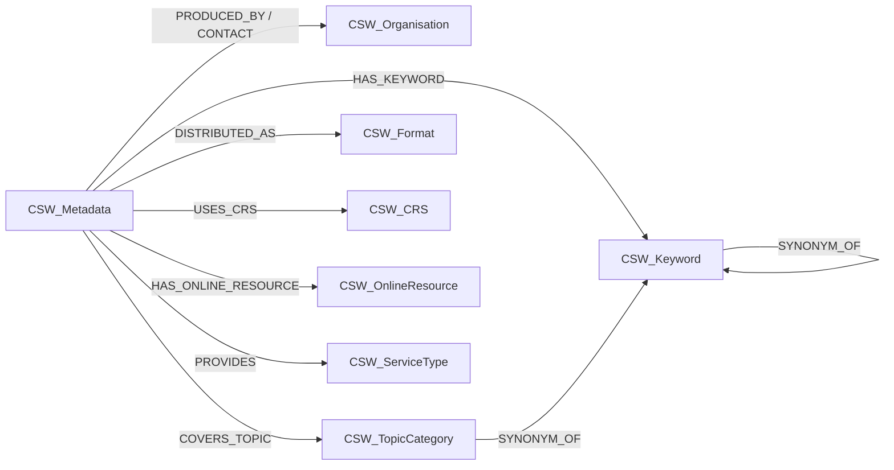

<!--
SPDX-FileCopyrightText: 2026 AlitaBernachot

SPDX-License-Identifier: MIT
-->

# Notebooks

## graph_builder.ipynb

Reads a directory of ISO 19139 XML metadata files (exported by the CSW crawler) and populates a **Neo4j** knowledge graph.

### Source namespacing

Set `SOURCE_NAME` to namespace all node labels. Each source gets its own label prefix — analogous to a PostgreSQL schema:

| `SOURCE_NAME` | Example labels |
|---|---|
| `"CSW"` (default) | `CSW_Metadata`, `CSW_Keyword`, `CSW_Organisation`, … |
| `"IGN"` | `IGN_Metadata`, `IGN_Keyword`, `IGN_Organisation`, … |
| `""` | `Metadata`, `Keyword`, `Organisation`, … (no prefix) |

---

## Graph Schema

> All labels are prefixed by `{SOURCE}_` (default: `CSW`).

### Nodes

| Label | Unique key | Properties |
|---|---|---|
| `CSW_Metadata` | `uuid` | `title`, `abstract`, `hierarchy_level`, `date_stamp`, `language`, `standard`, `metadata_url`, `bbox_west`, `bbox_east`, `bbox_south`, `bbox_north` |
| `CSW_Organisation` | `name` | — |
| `CSW_Keyword` | `value` | `thesaurus` |
| `CSW_TopicCategory` | `code` | `label_en`, `label_fr` |
| `CSW_Format` | `id` | `name`, `version` |
| `CSW_CRS` | `code` | `code_space` |
| `CSW_OnlineResource` | `url` | `protocol`, `name`, `function_code` |
| `CSW_ServiceType` | `name` | — (values: `WFS`, `WMS`, `WMTS`, `ATOM`, `WCS`, `WPS`) |

### Relationships

| Relationship | From → To | Properties |
|---|---|---|
| `PRODUCED_BY` | `CSW_Metadata` → `CSW_Organisation` | `role` (= `"owner"`) |
| `CONTACT` | `CSW_Metadata` → `CSW_Organisation` | `role` (e.g. `"pointOfContact"`) |
| `HAS_KEYWORD` | `CSW_Metadata` → `CSW_Keyword` | — |
| `COVERS_TOPIC` | `CSW_Metadata` → `CSW_TopicCategory` | — |
| `DISTRIBUTED_AS` | `CSW_Metadata` → `CSW_Format` | — |
| `USES_CRS` | `CSW_Metadata` → `CSW_CRS` | — |
| `HAS_ONLINE_RESOURCE` | `CSW_Metadata` → `CSW_OnlineResource` | — |
| `PROVIDES` | `CSW_Metadata` → `CSW_ServiceType` | — |
| `SEMANTICALLY_RELATED` | `CSW_Keyword` → `CSW_Keyword` | `type` (`BROADER_TERM`, `NARROWER_TERM`, `RELATED_TO`, `IS_TYPE_OF`, `PART_OF`), `confidence`, `inferred_by` |
| `SYNONYM_OF` | `CSW_Keyword` → `CSW_Keyword` | `source` (`"llm"`), `confidence`, `inferred_by` |
| `SYNONYM_OF` | `CSW_TopicCategory` → `CSW_Keyword` | `source` (`"iso19115_label"`), `lang` (`"en"` or `"fr"`) |

### Diagram



---

## csw_crawler.ipynb

Crawls a CSW (Catalogue Service for the Web) endpoint and exports metadata records as ISO 19139 XML files.

---

## Prerequisites

Neo4j must be reachable at `NEO4J_URI` (default: `bolt://localhost:7687`). Set credentials in `../.env`.

```yaml
# docker-compose.yml snippet to expose Neo4j locally
neo4j:
  ports:
    - "7474:7474"   # Browser UI → http://localhost:7474
    - "7687:7687"   # Bolt
```
